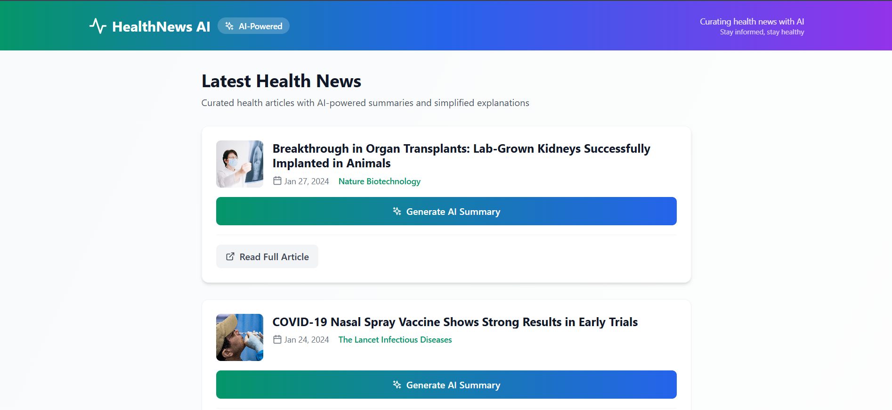
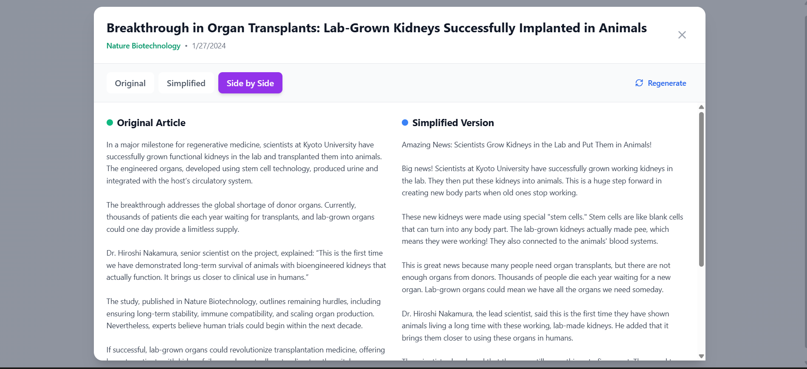

# AI-Based Health News Curator

A modern, full-stack web application that curates health news articles and uses AI to generate summaries, key takeaways, and simplified versions for better accessibility.

## 1. Project Setup & Demo

**Web**: Run `npm install` followed by `npm run dev:all` to launch both client and server locally.

**Mobile**:
- This project is fully responsive and optimized for mobile browsers.
- To test on mobile, access the local server IP on your device connected to the same network.

**Demo**:
- [Link to Demo Video/Hosted App] (Placeholder)

## 2. Problem Understanding

**The Challenge**: Health news articles are often complex, filled with medical jargon, and difficult for the average person to understand quickly. This creates a barrier to health literacy.

**Our Solution**: An AI-powered curator that:
- Generates concise minimal summaries.
- Simplifies complex medical terminology into everyday language.
- Provides key takeaways for quick consumption.

**Assumptions**:
- Users prefer "bite-sized" content.
- AI summaries must balance simplicity with medical accuracy.
- A mobile-first design is critical for news consumption.

## 3. AI Prompts & Iterations

We used **Google Gemini** for content generation. Here is the evolution of our prompting strategy:

**Initial Strategy**: Simple requests like "Summarize this".
**Issues**: Inconsistent formatting, varying lengths, and loss of critical medical context.

**Refined Prompts**:

*Summary Generation:*
```javascript
const summaryPrompt = `Please analyze this health news article and provide:

1. A TL;DR summary (maximum 2 lines)
2. Exactly 3 key takeaways as bullet points

Article Title: ${title}
Article Content: ${articleContent}

Format your response exactly like this:
Summary: [Your 2-line summary here]
Key Takeaways:
- [Takeaway 1]
- [Takeaway 2]
- [Takeaway 3]`;
```

*Simplification:*
```javascript
const prompt = `Please rewrite this health news article in a simpler, more accessible tone. Use:
- Simple, everyday language
- Shorter sentences
- Clear explanations of medical terms
- A friendly, conversational tone
- Keep all important information but make it easier to understand

Article Title: ${title}
Article Content: ${articleContent}

Format the response in a way that there exists no special characters or any formatting like bold or italics.

Please provide the simplified version:`;
```

## 4. Architecture & Code Structure

The application follows a clean client-server architecture.

**Frontend (React + Vite)**:
- `App.jsx`: Main application layout and routing.
- `src/components/`: Modular UI components (ArticleCard, Header, etc.).
- `src/hooks/useArticles.js`: Custom hook for fetching and managing article state.
- `src/services/api.js`: Handles communication with the backend.

**Backend (Node.js + Express)**:
- `server/index.js`: Entry point and API routes.
- `server/services/aiService.js`: Encapsulates Google Gemini API calls (`AIClient`).

**State Management**:
- Uses **React Custom Hooks** (`useArticles`, `useArticleAI`) to manage local state and API interactions effectively.

## 5. Screenshots / Screen Recording

**Main Feed**

*Clean card-based layout with AI-generated summaries.*

**Article View**

*Side-by-side comparison of original vs. simplified content.*

## 6. Known Issues / Improvements

- **AI Rate Limits**: Heavy usage may hit Gemini API quotas.
- **Offline Support**: Currently requires an active internet connection.
- **Search**: No filtering or search functionality implemented yet.

**Improvements with more time**:
- Implement Redis caching for AI responses.
- Add user accounts for bookmarking articles.
- Integrate WebSockets for real-time news updates.

## 7. Bonus Work

- **Dark Mode**: Fully implemented valid dark/light theme toggle.
- **Micro-animations**: Pulse effects for loading states and hover transitions.
- **Responsive Design**: Mobile-first layouts using Tailwind CSS.
- **Skeleton Loaders**: Polished loading states for better UX.
